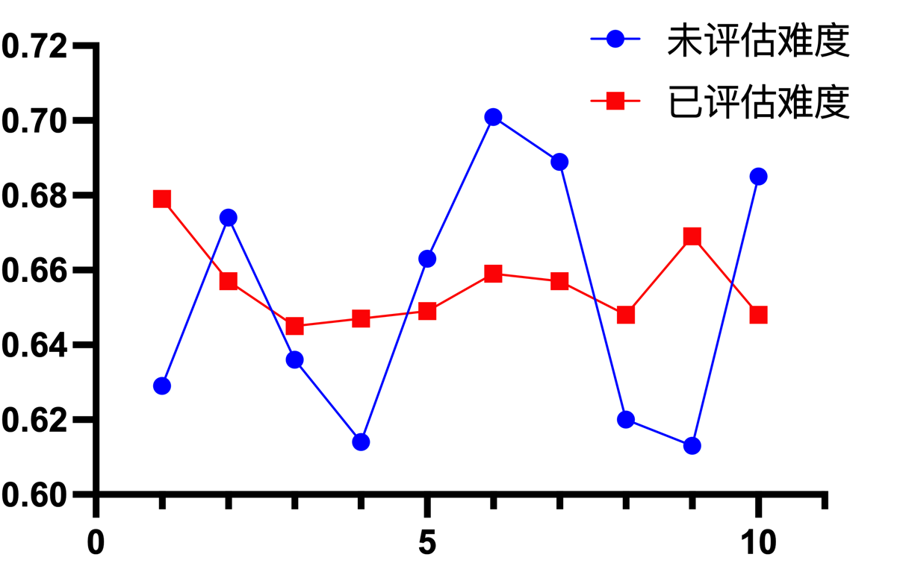
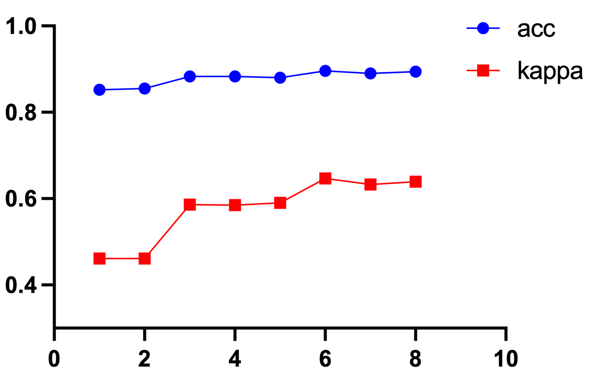
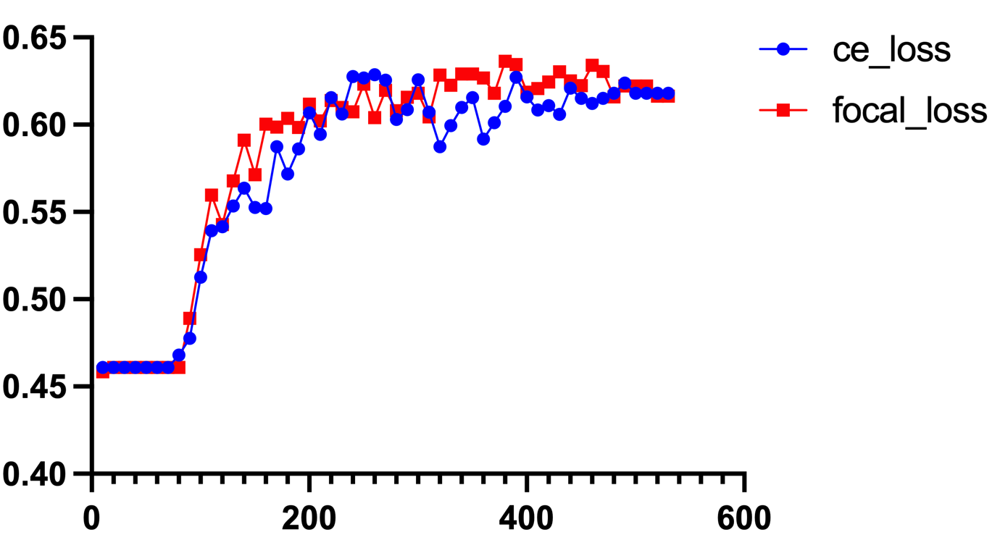
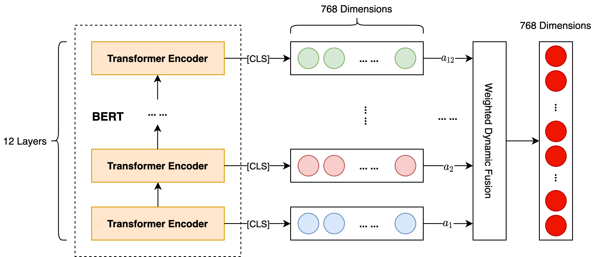
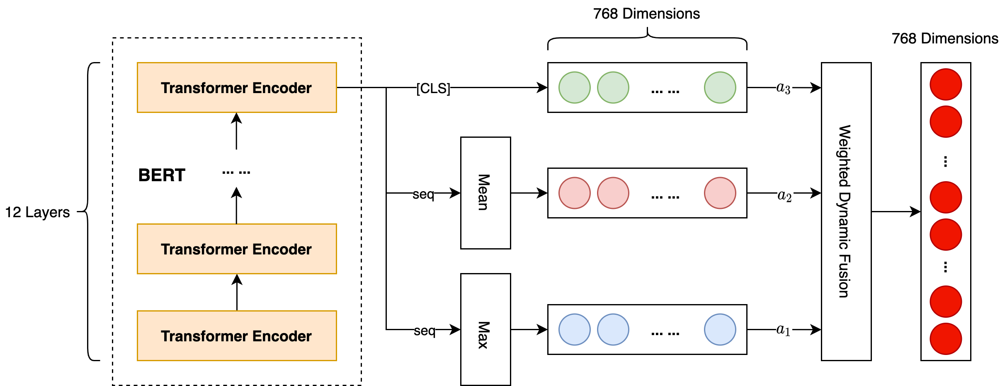

## 产品评论观点提取
### 比赛地址

> https://www.datafountain.cn/competitions/529

### 情感分类方案

#### 1. 基于训练难度划分数据集

在进行 K 折交叉验证时，首先根据样本类别做随机分层抽样，但这样的划分仍会导致模型训练结果波动较大，我们认为这有可能是每折训练数据的难易程度不均衡导致的，因此，我们在原有的数据划分方法上引入了对数据训练难度的考虑。

具体来说，首先使用基线模型对全量标注数据预测，得到预测分数，将其映射至 3 个难度级别，然后与真实标签组合得到共 9 种新的难度标签，之后对其使用随机 K 折分层抽样划分出 K 折训练集和验证集。

下图是使用基线模型进行 10 折交叉验证的训练结果，可以看到基于训练难度对数据集划分能够在很大程度上提升模型的稳定性，从而更好地进行之后的模型融合。

#### 2. 数据增强 & 数据清洗

首先考虑一些通用的文本增强手段，如下：

1. 随机同义/近义词替换：不考虑停用词，在句子中随机抽取n个词，然后从同义/近义词词典中随机抽取同义/近义词，并进行替换；
2. 随机字删除：句子中的每个词，以概率 p 随机删除，数字、时间不会删除；
3. 随机邻近字置换：一定范围内将原句子乱序；
4. 等价字替换：如句子中 1、一、壹、① 之间的相互替换；
5. 回译：借助百度垂直领域翻译的 API，对原始文本进行中->英->中的翻译。

另外，由于本赛题包括两个任务，NER 任务提供了命名实体的标注结果，因此，为了引入更多的信息，我们设计了一个 NER 实体随机替换的数据增强方式，具体方法如下：

已有的标注标签包括“银行”、“产品”、“评论-名词” 和 “评论-形容词”，考虑到情感分类任务的特点，我们选择对 “银行” 和 “产品” 两种实体进行提取，之后对每条数据的这两种实体以一定概率随机替换，从而得到增强后的样本。

通过对数据观察，由于是评论内容，其中口语化较严重，因此需要对数据进行清洗后再输入模型。首先去除数据的空白字符及首尾标点等多余信息，然后考虑到该数据来自于银行产品评论，对数字比较敏感，因此将 “13K”、“25W” 等数字别名转换成统一格式，方便模型识别，最后，由于数据均为中文，我们还将英文标点全部转换成了中文标点。

| 方法 | 分数 | 稳定性 |
| --- | :---: | :---: |
| 无 | 0.618 | - |
| 数据清洗 | **0.637** | - |
| 数据清洗 + 随机邻近字置换 | **0.645** | ↑↑ |
| 数据清洗 + 随机字删除 | **0.646** | ↑ |
| 数据清洗 + 随机同义词替换 | 0.636 | - |
| 数据清洗 + 随机近义近音词替换 | 0.626 | ↑ |
| 数据清洗 + 等价字替换 | 0.611 | - |
| 数据清洗 + 回译 | 0.636 | - |
| 数据清洗 + 标注实体随机替换 | **0.653** | - |
| 数据清洗 + 随机邻近字置换 + 随机字删除 | **0.651** | ↑ |
| 数据清洗 + 随机邻近字置换 + 标注实体随机替换 | **0.652** | ↑↑ |
| 数据清洗 + 随机字删除 + 标注实体随机替换 | 0.636 | ↑ |
| 数据清洗 + 随机邻近字置换 + 随机字删除 + 标注实体随机替换 | 0.617 | ↓ |

上表是使用数据清洗和数据增强后的模型表现效果，首先可以看到数据清洗可以在保证模型稳定性的基础上将分数提升 2 个百分点，因此之后的数据增强实验都是在数据清洗的基础上进行的。

基于表中的实验结果，数据清洗 + 随机邻近字置换 + 标注实体随机替换可以在大幅提升分数的同时，保证模型更好的稳定性。需要注意的是，将两个效果较好的数据增强方案结合后，整体的分数及稳定性都产生了下滑，因此，并不是数据增强越多越好，需要根据实现结果进行合理选择。

#### 3. 评估指标：Kappa 系数

分类问题中，最常见的评价指标是 Acc，它能够直接反映分正确的比例，同时计算非常简单。但是实际的分类问题种，各个类别的样本数量往往不太平衡。在这种不平衡数据集上如不加以调整，模型很容易偏向大类别而放弃小类别（eg：正负样本比例 1:9，直接全部预测为负，Acc 也有 90%。但正样本就完全被 “抛弃” 了)。此时整体 Acc 很高，但是部分类别完全不能被召回。

这时需要一种能够惩罚模型的 “偏向性” 的指标来代替 Acc。而根据 Kappa 的计算公式，越不平衡的混淆矩阵，p_e 越高，Kappa 值就越低，正好能够给 “偏向性” 强的模型打低分。

分别使用 Kappa 系数和 Acc 作为评估指标的训练曲线如下所示。

可以看到，Acc 整体变化远不如 Kappa 系数更加明显，因此选择 Kappa 系数作为评估指标更加合理，可以帮助我们更准确的选择最佳模型。

#### 4. 损失函数：Focal Loss

Focal Loss 可以认为是交叉熵损失的延伸，它的原理是使容易分类的样本权重降低，而对难分类的样本权重增加。

下图是同一模型下使用交叉熵损失函数和 Focal Loss 损失函数进行训练的迭代曲线，可以看到虽然 Focal Loss 对于模型准确率提升并不是很大，但是能够很好地提升训练的稳定性。

#### 5. 模型结构

这里我们设计了两种 BERT 的改进结构。

第一种改进结构我们称之为 BERT-hidden-fusion，其原理就是将隐藏层表示进行动态融合。具体做法为首先提取 BERT 的 12 层 Transformer 输出的 CLS 向量，之后为它们赋予一个初始权重，而后通过训练来确定权重值，并将每一层生成的表示加权平均，得到最终的文本向量表示。具体模型结构如下：

 

第二种改进结构我们称之为 BERT-CLS-mean-max，其原理就是为了充分利用最后一层的输出结果，将 CLS 向量与 Seq 的均值和最大值进行动态融合。具体模型结构如下：

 

模型对比结果如下表：

| 模型 | 分数 |
| --- | :---: |
| BERT-base | 0.652 |
| BERT-hidden-fusion | **0.669** |
| BERT-CLS-mean-max | **0.660** |

可以看到，我们针对 BERT 改进的两种模型，最终得分都在一定程度上有所提升。

#### 6. 对抗训练

这里我们选择 FGM 进行对抗训练。对已有的三个模型增加对抗训练后的对比结果如下表：

| 模型 | 分数 |
| --- | :---: |
| BERT-base + FGM | 0.656 |
| BERT-hidden-fusion + FGM | **0.686** |
| BERT-CLS-mean-max + FGM | **0.670** |

可以看到，对抗训练是有效的，在原有的分数基础上都提升了至少一个百分点，尤其对于 BERT-hidden-fusion 提升了接近两个百分点。
